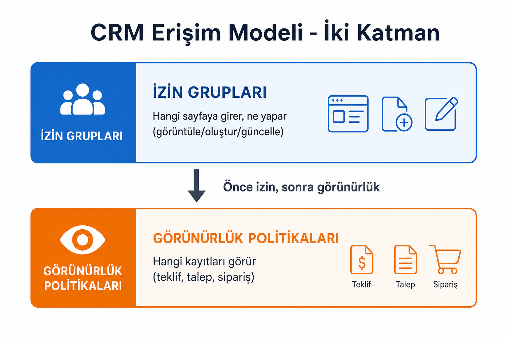
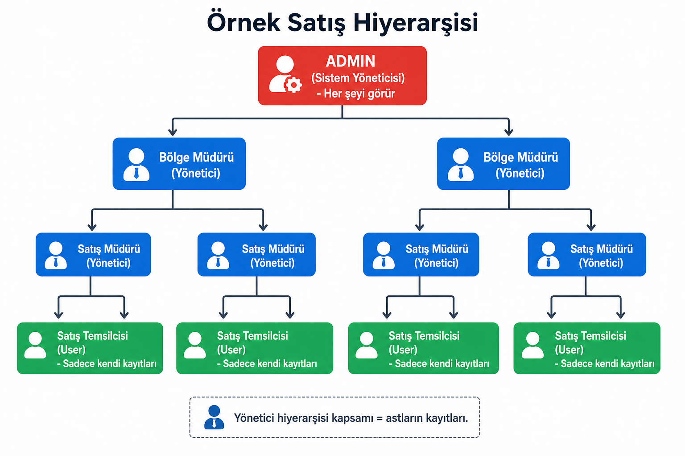
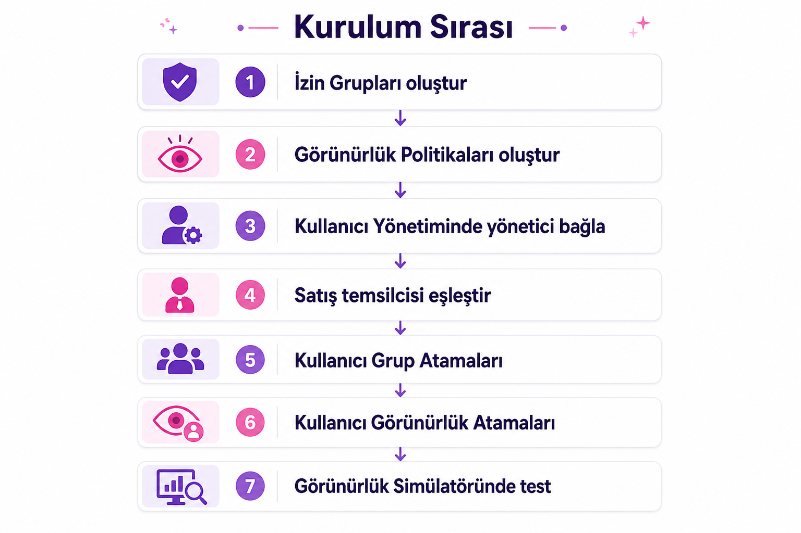

# SalesDesk Erişim Kontrolü ve Hiyerarşi Rehberi

Bu rehber, Verii SalesDesk web uygulamasında **Admin → Yönetici → Satış Temsilcisi (User)** hiyerarşisini kurmak için hazırlanmıştır. Kod bilgisi gerekmez; tüm adımlar arayüz üzerinden yapılır.

---

## İçindekiler

1. [Temel mantık: İki katman](#1-temel-mantık-iki-katman)
2. [Rol modeli özeti](#2-rol-modeli-özeti)
3. [Örnek organizasyon şeması](#3-örnek-organizasyon-şeması)
4. [Kurulum sırası](#4-kurulum-sırası)
5. [Adım 1: İzin grupları](#5-adım-1-izin-grupları)
6. [Adım 2: Görünürlük politikaları](#6-adım-2-görünürlük-politikaları)
7. [Adım 3: Yönetici ağacı (managerUserId)](#7-adım-3-yönetici-ağacı-manageruserid)
8. [Adım 4: Satış temsilcisi eşleştirme](#8-adım-4-satış-temsilcisi-eşleştirme)
9. [Adım 5: Kullanıcı grup atamaları](#9-adım-5-kullanıcı-grup-atamaları)
10. [Adım 6: Kullanıcı görünürlük atamaları](#10-adım-6-kullanıcı-görünürlük-atamaları)
11. [Adım 7: Simülatör ile doğrulama](#11-adım-7-simülatör-ile-doğrulama)
12. [Hızlı referans tabloları](#12-hızlı-referans-tabloları)
13. [Sık hatalar ve çözümler](#13-sık-hatalar-ve-çözümler)
14. [Müşteri (cari) görünürlüğü notu](#14-müşteri-cari-görünürlüğü-notu)
15. [Menü ve URL rehberi](#15-menü-ve-url-rehberi)

---

## 1. Temel mantık: İki katman



| Katman | Ne kontrol eder? | Nerede yönetilir? |
|--------|------------------|-------------------|
| **İzin grupları** | Hangi **sayfaya** girer, hangi **işlemi** yapar (görüntüle / oluştur / güncelle / sil) | Erişim Kontrolü → İzin Grupları + Kullanıcı Grup Atamaları |
| **Görünürlük politikaları** | O sayfada **hangi kayıtları** görür (teklif, talep, sipariş, aktivite, KPI) | Erişim Kontrolü → Görünürlük Politikaları + Kullanıcı Görünürlük Atamaları |

**Kısa kural:** İzin verir, görünürlük sınırlar.

- Sayfa açılıyor ama liste boş → görünürlük veya temsilci eşleşmesi sorunu.
- Sayfa hiç açılmıyor → izin grubu sorunu.
- Herkesin kaydını görüyor → fazla izin veya şirket geneli görünürlük.

---

## 2. Rol modeli özeti

| Rol | İzin grubu | Görünürlük (satış belgeleri) | Yönetici alanı |
|-----|------------|------------------------------|----------------|
| **Admin** | Sistem Yöneticisi (`isSystemAdmin`) | Gerekmez (tam erişim) | Boş veya üst seviye |
| **Yönetici** | Yönetici / Satış Müdürü grubu | **Yönetici hiyerarşisi** (kapsam 2) | Astları bağlı olmalı |
| **User (Satışçı)** | Satış Temsilcisi grubu | **Sadece kendisi** (kapsam 1) | Yöneticisi seçili olmalı |

---

## 3. Örnek organizasyon şeması



**Yönetici hiyerarşisi** kapsamı, `Kullanıcı Yönetimi` ekranındaki **Yönetici** alanına (`managerUserId`) dayanır. Bu ağaç doğru kurulmazsa yönetici ekibini listede görmez.

---

## 4. Kurulum sırası



1. İzin gruplarını tanımla
2. Görünürlük politikalarını oluştur
3. Kullanıcı yönetiminde yönetici bağlantılarını kur
4. Satış temsilcisi eşleştirmelerini yap
5. Kullanıcı grup atamaları
6. Kullanıcı görünürlük atamaları
7. Görünürlük simülatöründe test et

---

## 5. Adım 1: İzin grupları

**Menü:** Erişim Kontrolü → Yetki ve Kullanıcı Yönetimi → **İzin Grupları**  
**URL:** `/access-control/permission-groups`

### Grup A — Sistem Yöneticisi (genelde hazır gelir)

- **Sistem Yöneticisi** işaretli
- Tüm sayfalar ve işlemler açık (bireysel izin kontrolü atlanır)
- Sadece gerçek admin hesaplarına verin

### Grup B — Yönetici / Satış Müdürü

Önerilen izinler:

- `sales.quotations.view`, `create`, `update`
- `sales.demands.view`, `create`, `update`
- `sales.orders.view`, `create`, `update`
- `customers.customer-management.view`
- `customer360.overview.view`
- `activity.activity-management.view`, `activity.daily-tasks.view`
- `salesmen360.overview.view`
- `reports.list.view` (isteğe bağlı)
- Onay ekranları (onaycı ise)

**Vermeyin (genelde):** erişim kontrolü tanımları, sistem ayarları, kullanıcı yönetimi (opsiyonel).

### Grup C — Satış Temsilcisi (User)

Önerilen izinler:

- `sales.quotations.view`, `create` (+ gerekirse `update`)
- `sales.demands.view`, `create`
- `customers.customer-management.view`
- `customer360.overview.view`
- `activity.activity-management.view`, `activity.daily-tasks.view`

**Vermeyin:** fiyat kuralı yönetimi, onay akışı tanımı, erişim kontrolü ekranları, rapor tasarımcısı (iş gereği değilse).

> Bir kullanıcı birden fazla grupta olabilir; izinler **birleşir**. User’a yanlışlıkla yönetici grubu verilirse fazla yetki alır.

---

## 6. Adım 2: Görünürlük politikaları

**Menü:** Erişim Kontrolü → **Görünürlük Politikaları**  
**URL:** `/access-control/visibility-policies`

### Kapsam tipleri (scopeType)

| Değer | Ad | Kim için? |
|-------|-----|-----------|
| 1 | Sadece kendisi | Satış temsilcileri |
| 2 | Yönetici hiyerarşisi | Yöneticiler (astlarının kayıtları) |
| 3 | İzin grubu | Aynı izin gruptaki kullanıcılar (takım/peer modeli) |
| 4 | Şirket geneli | Herkesin kayıtları (admin veya özel durumlar) |

### Entity (varlık) türleri

Her modül **ayrı** politika ister:

| Entity kodu | Türkçe |
|-------------|--------|
| `Quotation` | Teklif |
| `Demand` | Talep |
| `Order` | Sipariş |
| `Activity` | Aktivite |
| `Salesman360` | Satışçı KPI |

### Önerilen politika şablonları

Her entity için iki politika oluşturun:

| Politika adı örneği | Entity | Kapsam | includeSelf |
|---------------------|--------|--------|-------------|
| Teklif - Sadece Kendisi | Quotation | 1 | Açık |
| Teklif - Yönetici Hiyerarşisi | Quotation | 2 | Açık |
| Talep - Sadece Kendisi | Demand | 1 | Açık |
| Talep - Yönetici Hiyerarşisi | Demand | 2 | Açık |
| Sipariş - Sadece Kendisi | Order | 1 | Açık |
| Sipariş - Yönetici Hiyerarşisi | Order | 2 | Açık |
| Aktivite - Sadece Kendisi | Activity | 1 | Açık |
| Aktivite - Yönetici Hiyerarşisi | Activity | 2 | Açık |
| KPI - Sadece Kendisi | Salesman360 | 1 | Açık |
| KPI - Yönetici Hiyerarşisi | Salesman360 | 2 | Açık |

**includeSelf:** Yöneticilerde **açık** → kendi kayıtları + ekibin kayıtları.

**İzin grubu kapsamı (3):** Gerçek ast–üst hiyerarşi için kullanmayın; aynı gruptaki herkes birbirini görür.

---

## 7. Adım 3: Yönetici ağacı (managerUserId)

**Menü:** Erişim Kontrolü → **Kullanıcı Yönetimi**  
**URL:** `/user-management`

Her kullanıcıyı düzenleyin → **Yönetici** alanı:

- Satış temsilcisinin yöneticisi: Satış Müdürü
- Satış Müdürünün yöneticisi: Bölge Müdürü (varsa)
- Admin: boş veya en üst

Bu alan, **Yönetici hiyerarşisi** görünürlük kapsamının temelidir.

---

## 8. Adım 4: Satış temsilcisi eşleştirme

**Menü:** Tanımlar → **Satış Temsilcisi Eşleştirme**  
**URL:** `/definitions/sales-rep-match-management`

Teklif / talep / sipariş listeleri temsilci (`representativeId`) üzerinden filtrelenir. SalesDesk kullanıcısı ↔ ERP satış temsilcisi eşleşmesi yoksa user “kendi kaydı” bile listede görünmeyebilir.

Her satış temsilcisine eşleşme yapın.

---

## 9. Adım 5: Kullanıcı grup atamaları

**Menü:** Erişim Kontrolü → **Kullanıcı Grup Atamaları**  
**URL:** `/access-control/user-group-assignments`

| Rol | Atanacak grup |
|-----|----------------|
| Admin | Sistem Yöneticisi |
| Yönetici | Yönetici / Satış Müdürü |
| User | Satış Temsilcisi |

Kaydet ve uygula.

---

## 10. Adım 6: Kullanıcı görünürlük atamaları

**Menü:** Erişim Kontrolü → **Kullanıcı Görünürlük Atamaları**  
**URL:** `/access-control/user-visibility-assignments`

1. Kullanıcıyı seç
2. Her kart için politika seç:

| Rol | Teklif, Talep, Sipariş, Aktivite, KPI |
|-----|----------------------------------------|
| Admin | Atama gerekmez |
| Yönetici | **Yönetici hiyerarşisi** politikası |
| User | **Sadece kendisi** politikası |

> Teklif kartına atadınız ama Talep kartını unuttunuz → sadece teklifte doğru davranır, diğer modüllerde farklı sonuç çıkar.

---

## 11. Adım 7: Simülatör ile doğrulama

**Menü:** Erişim Kontrolü → **Görünürlük Simülatörü**  
**URL:** `/access-control/visibility-simulator`

| Test | Beklenen |
|------|----------|
| User + Teklif | Görünür kullanıcılar: sadece kendisi |
| Yönetici + Teklif | Kendisi + astları |
| Admin | Sistem admin veya şirket geneli |

İsteğe bağlı: Kayıt ID girerek view / update / delete / onay simülasyonu.

Son adım: ilgili hesapla giriş yapıp gerçek teklif listesini kontrol edin.

---

## 12. Hızlı referans tabloları

### Sorun giderme

| Belirti | İlk bakılacak yer |
|---------|-------------------|
| Menü/sayfa yok | İzin grupları |
| Sayfa var, liste boş | Görünürlük ataması + temsilci eşleşmesi |
| Çok fazla kayıt | Yanlış görünürlük (şirket geneli) veya fazla izin grubu |
| Yönetici ekibi görmüyor | `managerUserId` + hiyerarşi politikası |

### Görünürlük kapsamı vs izin grubu kapsamı (3)

| | Yönetici hiyerarşisi (2) | İzin grubu (3) |
|--|--------------------------|----------------|
| Mantık | Ast–üst ağacı | Aynı gruptaki herkes |
| Kullanım | Satış müdürü modeli | Takım/peer modeli |

---

## 13. Sık hatalar ve çözümler

1. **Sadece izin grubu atadım** → Sayfa açılır, kayıtlar kısıtlı kalır.
2. **Sadece görünürlük atadım** → Liste doğru ama menü kapalı.
3. **Yönetici hiyerarşisi politikası var, yönetici alanı boş** → Ast listesi oluşmaz.
4. **User’a şirket geneli politika** → Herkesin teklifini görür.
5. **Yanlış entity** → Aktivite’ye atadım, Teklif değişmedi.
6. **Onay override** → Onaycı geçici olarak kapsam dışı kayıt görebilir (normal).

---

## 14. Müşteri (cari) görünürlüğü notu

Görünürlük entity listesinde **Müşteri (Customer)** yok. Müşteri listesi ayrı API kullanır. Pratikte:

- Sayfa izni müşteri menüsünü açar
- Kayıt sınırı muhtemelen satış temsilcisi kodu veya backend kuralına bağlıdır
- User “sadece kendi carileri” için temsilci kodu + satış belgelerinde self politikası birlikte düşünülmeli

---

## 15. Menü ve URL rehberi

| Ekran | URL |
|-------|-----|
| İzin Grupları | `/access-control/permission-groups` |
| Kullanıcı Grup Atamaları | `/access-control/user-group-assignments` |
| Görünürlük Politikaları | `/access-control/visibility-policies` |
| Kullanıcı Görünürlük Atamaları | `/access-control/user-visibility-assignments` |
| Görünürlük Simülatörü | `/access-control/visibility-simulator` |
| Erişim Kontrolü Rehberi (uygulama içi) | `/access-control/guide` |
| Kullanıcı Yönetimi | `/user-management` |
| Satış Temsilcisi Eşleştirme | `/definitions/sales-rep-match-management` |

---

## Kısa karar ağacı

```
Kullanıcı işlem yapamıyor?     → İzin grupları
Çok az / çok fazla kayıt?    → Görünürlük politikaları
Yönetici ekibi görmüyor?     → managerUserId + hiyerarşi politikası
Her şeyden emin değilsen?    → Görünürlük Simülatörü
```

---

*Son güncelleme: Verii SalesDesk Web — Erişim Kontrolü modülü.*
